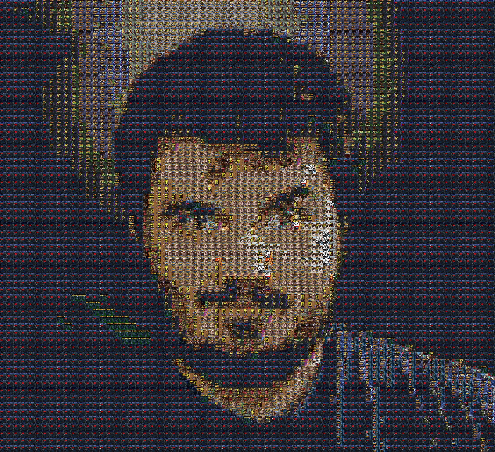
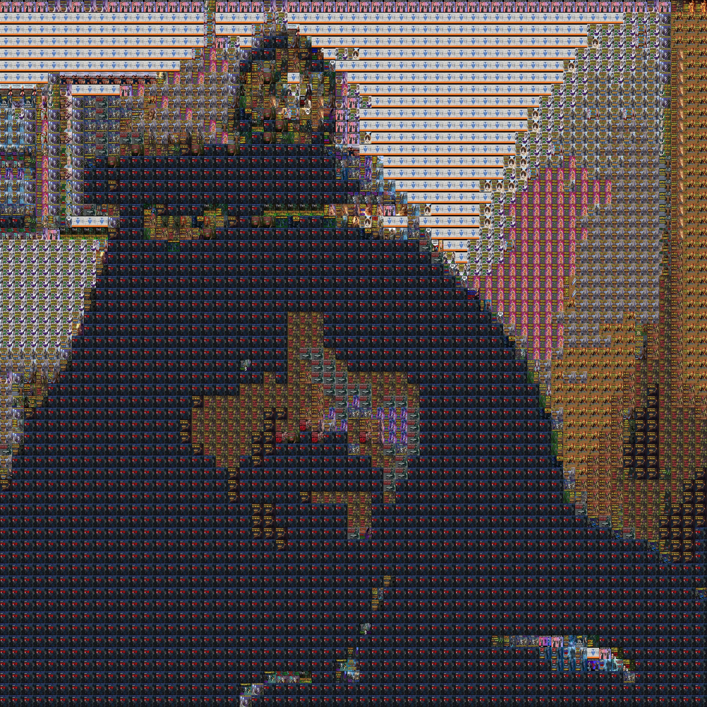

# A stupidly simple Wander generator
Ever felt a burning desire to generate some ***Wanderbrauns*** yourself? Excellent! This is the toolchain for you.  

---
The core library used: [Mosaic by CodeBox](https://github.com/codebox/mosaic).

## Examples


---
<details>
<summary>High-Quality Wander-Young </summary>


</details>

---
<details>
<summary>Wander-Acolyte. Or just an orthodoxal icon, idk</summary>


</details>

---
<details>
<summary>Just Wander</summary>


</details>

---
Check out the others in the repository file list as well!
## How to
In case you ***do*** know what you do, you'll be fine.  
Otherwise, here are the simple instructions for you.

1. Install [Python](https://www.python.org/downloads/windows/). 
2. Get the copy of this rep:
    - simply download it: Code => Download .zip. Then unzip.
    - or clone it with git:
        - install [git](https://git-scm.com/) 
        - open cmd
        - type `git clone https://github.com/l-Fingon-l/Wander_Generator` and press Enter
3. Install the libraries needed. For windows, e.g.:
    - open cmd
    - type in `py -m install requests` and press Enter
    - type in `py -m install Pillow` and press Enter
4. Download the thumbnails if you don't have them yet:
    - get [YouTube Data API v3](https://developers.google.com/youtube/v3/docs)
    - open cmd
    - navigate to the project folder (google how to)
    - run `py main.py`
    - type in your API key when prompted
5. Choose the source picture from `source_images/` folder. Or add the one of yours.
6. Run the `mosaic.py` renderer:
    - open cmd
    - run `py mosaic.py source_images/wander.jpg images` command.
    - you are about to see the progress displayed in cmd and the `mosaic.jpg` output will be ready as soon as the rendering finishes.
    - you may change the argument `source_images.wander.jpg` to use some other source images.
    - you may change the argument `images` to, e.g. `images/wc3` or `images/aoe` to use the tiles from that subset exclusively.
    - you may open `mosaic.py` file and change the configs: 
    ```py
    # Change these 3 config parameters to suit your needs...
    TILE_SIZE      = 50  # 50		# height/width of mosaic tiles in pixels
    TILE_MATCH_RES = 10  # 5		# higher values give better fit but require more processing
    ENLARGEMENT    = 3   # 8		# this many times wider and taller than the original
    ```

Happy Wandering!
